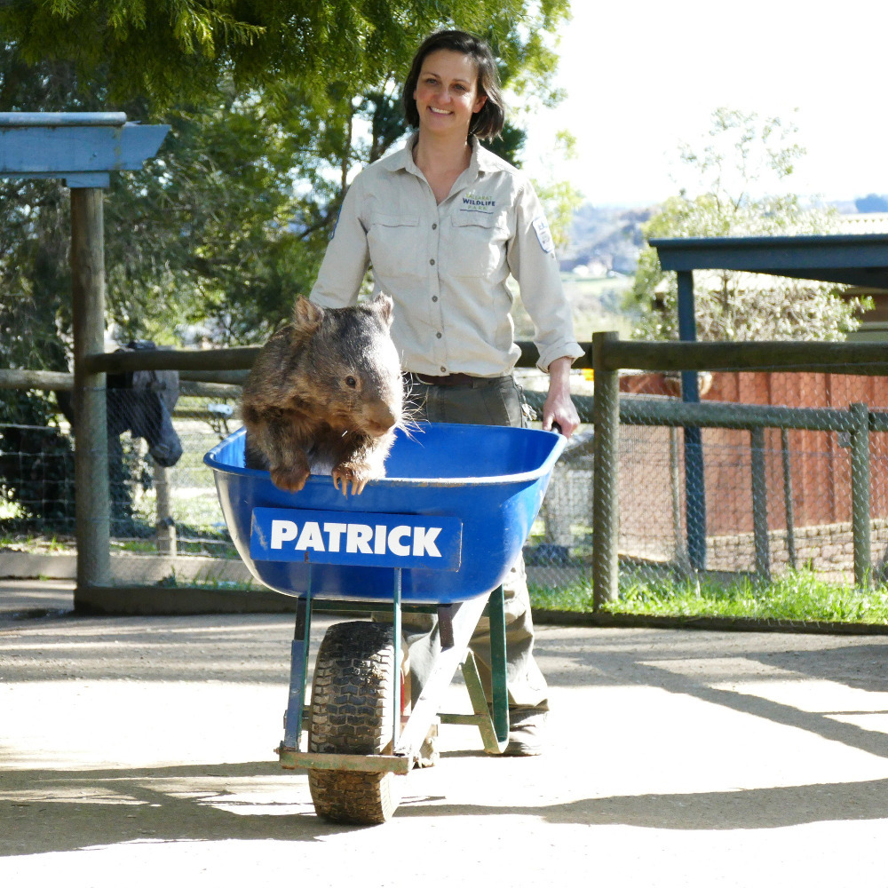

Common Name: Wombat

Scientific Name: Vombatus ursinus

Type: Mammals

Diet: Herbivore

Group Name: Mob, colony, wisdom

## Twerking Your Enemies to Death

The wombat's primary defense is their toughnened rear hide, with most of the posterior made of cartilage. In other words, they have a rock-hard dump truck of an ass, lacking a tail and sporting few pain receptors. 

When they are being chased, they resort to their tunnels (a common wombat occupies up to 23 hectares), using their badonkadonk to block a pursuing attacker. According to an [urban legend](https://en.wikipedia.org/wiki/Urban_legend), and the findings of crushed fox and dingo skulls around wombat burrows, have led researchers to theorize that these marsupials mat also use their armored ass to smash predator's skulls against the roof of their burrow, effectively twerking it to death.

[Here is an animation to spark your imagination.](https://youtu.be/v0sjqnK3Jms?t=167)

## Cubic Poop

Wombats have extraordinarily slow metabolism, taking around 8 to 14 days to complete digestion, which aids their survival in arid conditions. They also leave distinctive cubic faeces. As wombats arrange these feces to mark territories and attract mates, it is believed that the cubic shape makes them more stackable and less likely to roll, which gives this shape a biological advantage. 

The method by which the wombat produces them is not well understood, but it is believed that the wombat intestine stretches preferentially at the walls, with two flexible and two stiff areas around its intestines. The adult wombat produces between 80 and 100, 2cm pieces of feces in a single night.

If we pooped that often, we's produce about 10 meters of feces every day. (Thats twice the size of a full-grown giraffe)

Fun fact: wombat poo has its own specialised flies. The 25 species of wombat flies have been a bit of a mystery, until now. At the [Australian National Insect Collection](https://www.csiro.au/en/about/facilities-collections/Collections/ANIC), they've been studying their diversity and evolution to understand where they came from and how long they've been keen on this very particular fare.

## Reproduction

Fertile females flirt by biting a male's bottom and running away, with him following in the hot pursuit. 

After a short [gestation](https://en.wikipedia.org/wiki/Gestation) period of around 30 days, the mother gives birth to a tiny, underdeveloped joey around the size of a jellybean that crawls into the pouch on her belly. Bare-nosed wombat mothers have one baby at a time.

In wombats, the pouch faces backwards. This is an adaptation to prevent the pouch filling with soil when digging. 

## Cultural Significance

Due to their burrowing behavior, some farmers consider common wombats a nuisance. However, wombats have also been featured on Australian postage stamps and coins. One notable example is ["Fatso the Fat-Arsed Wombat"](https://en.wikipedia.org/wiki/Fatso_the_Fat-Arsed_Wombat), a tongue-in-cheek "unofficial" mascot for the 2000 Sydney Olympics.

## Fun facts

- Like a platypus, wombats have biofluorescent fur and glow in the dark under UV light. Scientists don't yet know why.
- Wombats are suprisingly fast, reaching speeds up to 40 km per hour over a short distance.

---

Patrick was perhaps the most well known wombat. When he passed in 2017, he reached the age of **31**, which is about equivalent with 100+ in human years. He was the oldest bare-nosed wombat in captivity in the world, but is now surpassed by Wain at 32 years old living in Satsukiyama Zoo, Japan.

Patrick was orphaned as a tiny baby, and hand raised by the owner thirty years ago. The team tried to release him bacj into the wild on several occasions, but his timid nature meant he was unable to defend himself - and so he remained an adored edition at the [Ballarat Wildlife Park instead](https://en.wikipedia.org/wiki/Ballarat_Wildlife_Park)

As for his inability to connect with the female wombats, his trainers say he's just too much of a 'SNAW' - a sensitive, new-age wombat, according to the [ABC](https://www.abc.net.au/news/2015-08-25/worlds-oldest-captive-wombat-patrick-joins-tinder-to-find-love/6722348)

> Rest in Peace Patrick the Wombat

---

[[index]]
